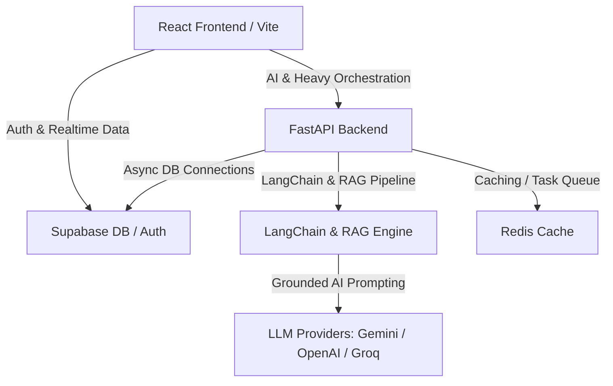
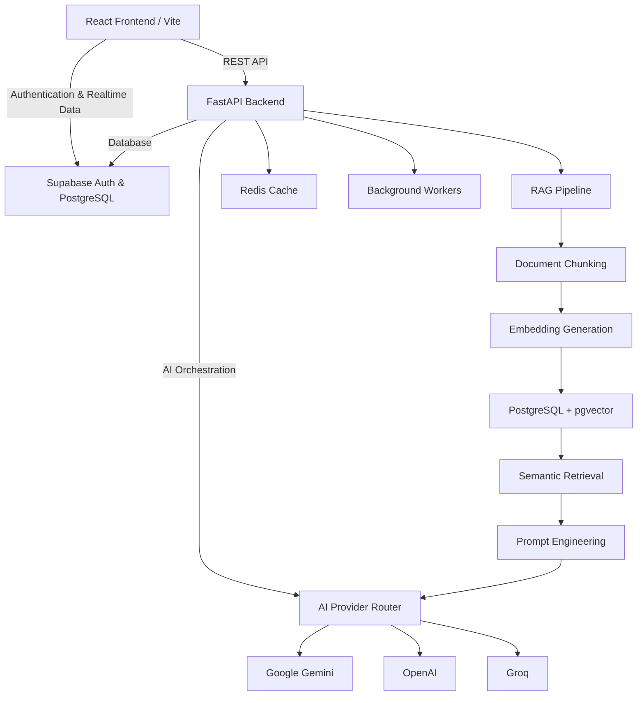

# 🌟 SHAKTHI — Empowering Women Athletes

<<<<<<< HEAD
**SHAKTHI** (*Safety-first Mentorship and Scholarship Platform for Female Athletes*) is a comprehensive, production-grade digital ecosystem designed to connect, guide, and protect aspiring women athletes across India. The platform integrates a modern web application with a robust Python backend powered by **LangChain**, **Retrieval-Augmented Generation (RAG)**, and advanced **LLMs (Large Language Models)**, providing access to mentorship, sports-friendly colleges, scholarships, and safe, anonymous safety-reporting tools.

---

## 🏗️ System Architecture & Stack

SHAKTHI is built as a split-architecture system: a responsive React Single Page Application (SPA) frontend that connects to both Supabase (for authentication and direct database synchronization) and a custom FastAPI Python service (for AI orchestration, LangChain processing, RAG lookup, and safety checks).



### 🧠 Advanced AI, RAG & LLM Tech Stack
* **RAG Engine (Retrieval-Augmented Generation):** Custom pipeline that ingests official athletic documents, guidelines, safety materials, and scholarships, parses PDFs, splits them into semantic chunks, generates embeddings, stores them in PostgreSQL (via vector search), and retrieves grounded context to eliminate hallucinations.
* **LangChain Integration:** Utilizes LangChain's specialized text splitters (e.g., `RecursiveCharacterTextSplitter`) to chunk documents with dynamic constraints (800-character chunk sizes with 100-character overlap) for optimal context preservation during retrieval.
* **LLM (Large Language Model) Orchestration:** Powered by a dynamic provider router (`AIProviderRouter`) that interfaces with:
  * **Google Gemini API** (using `gemini-2.5-flash` as primary)
  * **OpenAI API** (as high-performance fallback)
  * **Groq API** (for low-latency open-source model inference)

### 💻 Frontend Tech Stack
* **Framework:** React 18 + Vite + TypeScript (structured with React Router v7)
* **Styling & UI:** Tailwind CSS + [shadcn/ui](https://ui.shadcn.com/) (Radix UI primitives) + Lucide Icons
* **Data Flow:** TanStack Query (React Query v5) & React Context API
* **Client Database Integration:** Supabase Client (`@supabase/supabase-js`)

### 🐍 Backend Service Stack
* **Framework:** Python 3.11+ / FastAPI (fully asynchronous)
* **ORM & Database:** SQLAlchemy 2.0 (asyncpg driver) + Alembic migrations
* **Data Validation:** Pydantic v2
* **Caching & Jobs:** Redis + Celery
* **Testing:** Pytest (utilizing schema-isolated test setups)
* **Containerization:** Docker & Docker Compose

---

## 🌟 Core AI & RAG Features

### 🔍 Grounded RAG Assistant (`RAGOrchestrator`)
The application implements an advanced RAG orchestration pipeline that intercepts user queries, retrieves corresponding context from indexed documents, and passes it to the active LLM:
* **Scholarship Discovery:** Cross-references athlete profiles with scholarship rules, and calculates compatibility scores grounded in the source scholarship criteria.
* **College Profiling:** Analyzes college rosters, admission rules, and facilities to evaluate how well a college matches an athlete's background.
* **Legal & Safety QA:** Grounded answers explaining athlete rights under the **POCSO Act** and child protection policies using official documentation.
* **Verified Citations:** Every AI response generated via the RAG orchestrator provides precise references and sources (e.g., page numbers, document titles) to ensure transparency and accountability.

### 🛡️ Guardrails & Content Moderation
* **AI Message Risk Analysis:** LLM-powered safety moderation evaluations (`message-risk`) check direct chat logs to detect harassment, grooming, and protocol violations before storing messages.
* **Dynamic Provider Routing:** Automatic failover between LLM providers (Gemini, OpenAI, Groq) ensures 100% uptime for AI chats and matching engines.

---

## 🌟 Other Key Features

### 👤 Role-Based Portals & Onboarding
Custom workspaces and multi-step onboarding flows for major stakeholder groups:
* **Athletes:** Track performance goals, apply to mentors, explore sports-friendly universities, save scholarships, and communicate securely.
* **Mentors:** Review and manage incoming mentorship requests, monitor trainee progress, and host communications.
* **Guardians:** Monitor minor athlete activity, check scholarship applications, and ensure online safety.
* **Admins & Safety Officers:** Monitor system health, manage user suspensions, verify mentors, and act on safety incident tickets.
* **Coaches & Sponsors:** Provide athletic training structures and funding opportunities.

### 🛡️ Safety-First Center
* **Anonymous Incident Reporting:** Secure mechanism to report harassment, toxic coaching, or safety breaches.
* **Encrypted Tracking:** Users receive safety ticket numbers (`SAF-XXXX`) to track status privately.
* **Administrative Escalation:** Automated routing of high-priority flags to designated Safety Officers.
=======
**SHAKTHI** (*Safety-first Mentorship and Scholarship Platform for Female Athletes*) is a production-grade digital ecosystem designed to connect, guide, and protect aspiring women athletes across India. The platform combines a modern React web application with a powerful FastAPI backend powered by **LangChain**, **Retrieval-Augmented Generation (RAG)**, and **Large Language Models (LLMs)** to provide AI-powered mentorship, scholarship discovery, sports-friendly college recommendations, and secure anonymous safety reporting.

---

# 🏗️ System Architecture



---

# 🛠️ Complete Tech Stack

## 🎨 Frontend

- React 18
- Vite
- TypeScript
- React Router v7
- Tailwind CSS
- shadcn/ui
- Radix UI
- Lucide React
- TanStack Query (React Query v5)
- React Context API
- Axios
- React Hook Form
- Zod
- Supabase JavaScript SDK
>>>>>>> 6f4e322b467689ec16dfdb195c74fc998b849775

---

## ⚙️ Backend

- Python 3.11+
- FastAPI
- Uvicorn
- SQLAlchemy 2.0
- AsyncPG
- Alembic
- Pydantic v2
- Celery
- Redis
- AsyncIO

---

## 🗄️ Database

- PostgreSQL
- Supabase
- pgvector
- Vector Search
- Semantic Search

---

## 🤖 Artificial Intelligence

### LLM Providers

- Google Gemini 2.5 Flash
- OpenAI GPT
- Groq LLMs

### AI Frameworks

- LangChain
- Retrieval-Augmented Generation (RAG)
- Prompt Engineering
- AI Provider Router
- AI Guardrails
- Context Injection
- AI Risk Analysis
- AI Moderation
- Dynamic Provider Routing

---

## 📚 RAG Pipeline

- PDF Processing
- Document Parsing
- RecursiveCharacterTextSplitter
- Document Chunking
- Metadata Extraction
- Embedding Generation
- Vector Embeddings
- pgvector Storage
- Semantic Search
- Similarity Search
- Context Retrieval
- Grounded Prompting
- Citation Generation
- Hallucination Reduction

---

## 🔍 AI Features

- Scholarship Recommendation
- College Recommendation
- Athlete Mentorship Assistant
- Legal & Safety Question Answering
- AI Chat Assistant
- Verified Source Citations
- Safety Message Risk Detection
- AI Provider Failover

---

## 🔐 Authentication & Security

- JWT Authentication
- Refresh Tokens
- Role-Based Access Control (RBAC)
- Protected Routes
- Password Hashing
- Environment Variables
- Secure REST APIs

---

## 📡 APIs

- REST APIs
- Async FastAPI Endpoints
- JSON APIs
- Dependency Injection
- Request Validation
- Response Models

---

## ⚡ Background Processing

- Redis
- Celery
- Background Workers
- Task Queue

---

## 🧪 Testing

- Pytest
- Unit Testing
- API Testing
- Schema Testing

---

## 🚀 DevOps

- Docker
- Docker Compose
- Git
- GitHub
- Virtual Environments
- Production Deployment

---

# 🧠 AI Architecture

```text
<<<<<<< HEAD
SHAKTHI-AI/
├── app/                        # Python Backend Application
│   ├── api/                    # API Routing Layer
│   │   └── v1/                 # Version 1 Endpoints (auth, athletes, safety, etc.)
│   ├── ai/                     # AI Router, prompts, and system instructions
│   ├── core/                   # Security (JWT), configurations, and dependency injections
│   ├── models/                 # SQLAlchemy 2.0 ORM Models (User, Athlete, Mentor, etc.)
│   ├── schemas/                # Pydantic v2 schemas for request validation & serialization
│   ├── services/               # Core business logic (RAG Orchestrator, Ingestion, Storage)
│   │   ├── ingestion.py        # LangChain text splitting and document chunking service
│   │   ├── retriever.py        # Semantic vector database retrieval helper
│   │   └── orchestrator.py     # RAG Orchestrator compiling grounded LLM prompts
│   ├── utils/                  # Helper utilities (file handling, logs)
│   ├── database.py             # Database engine & session setup
│   ├── main.py                 # FastAPI Entry point
│   └── seed_data.py            # Development database seeder
├── alembic/                    # Database Migrations folder
├── project/                    # React Frontend Application
│   ├── src/                    # Frontend source files
│   │   ├── components/         # Common layouts, protected routes, and shadcn UI components
│   │   ├── constants/          # Static application mappings
│   │   ├── contexts/           # Authentication state wrapper
│   │   ├── hooks/              # Custom React Hooks (queries, mutations)
│   │   ├── lib/                # Client configurations (Supabase connection, mock details)
│   │   ├── pages/              # Role-based panels, safety dashboard, and chat page
│   │   ├── services/           # Data services (API clients and Gemini direct endpoints)
│   │   └── types/              # Global TypeScript interfaces
│   ├── package.json            # React project dependencies
│   ├── vite.config.ts          # Vite compiler config
│   └── tailwind.config.js      # Tailwind UI definitions
├── tests/                      # Pytest Suite for Backend
├── Dockerfile                  # Container building script for FastAPI
├── docker-compose.yml          # Local orchestration setup (PostgreSQL, Redis, FastAPI)
└── requirements.txt            # Python Backend requirements
=======
                        User
                          │
                          ▼
                React + Vite Frontend
                          │
            Authentication & API Requests
                          │
         ┌────────────────┴────────────────┐
         ▼                                 ▼
 Supabase Auth                    FastAPI Backend
   PostgreSQL                           │
                                        │
                         ┌──────────────┴──────────────┐
                         ▼                             ▼
                  AI Provider Router             Redis Cache
                         │
        ┌────────────────┼─────────────────┐
        ▼                ▼                 ▼
 Google Gemini        OpenAI             Groq
                         ▲
                         │
                  Prompt Engineering
                         ▲
                  Context Retrieval
                         ▲
                  Semantic Search
                         ▲
            PostgreSQL + pgvector
                         ▲
                 Vector Embeddings
                         ▲
              Document Chunking
                         ▲
              PDF / Knowledge Base
>>>>>>> 6f4e322b467689ec16dfdb195c74fc998b849775
```

---

<<<<<<< HEAD
## ⚙️ Configuration & Environment Variables

Create a `.env` file in the root directory (for the Python backend) and `.env` in the `project/` directory (for the React frontend).

### Backend `.env` File Parameters
```env
# Application Settings
APP_NAME=SHAKTHI
ENVIRONMENT=development
DEBUG=true
PORT=8000

# Database (Supabase pooler or local PostgreSQL)
DATABASE_URL=postgresql://<user>:<password>@<host>:5432/<db_name>

# Caching & Background Jobs
REDIS_URL=redis://localhost:6379/0

# Security (JWT validation)
JWT_SECRET_KEY=your-secure-32-char-access-token-key
JWT_REFRESH_SECRET_KEY=your-secure-32-char-refresh-token-key

# AI, RAG & LLM Configurations
GEMINI_API_KEY=your-google-gemini-api-key
OPENAI_API_KEY=your-openai-api-key
GROQ_API_KEY=your-groq-api-key
PRIMARY_AI_PROVIDER=gemini
GEMINI_MODEL=gemini-2.5-flash
PGVECTOR_ENABLED=true
ENABLE_RAG=true
ENABLE_SEMANTIC_SEARCH=true
```

### Frontend `project/.env` File Parameters
```env
VITE_SUPABASE_URL=https://your-supabase-project-id.supabase.co
VITE_SUPABASE_ANON_KEY=your-supabase-anonymous-public-key
VITE_API_URL=http://localhost:8000/api/v1
```

---

## 🚀 Installation & Local Development

Follow these guides to set up individual components.

### 🐳 Option 1: Quick Start with Docker (Recommended)
This runs PostgreSQL 16, Redis 7, and the FastAPI Python service automatically:

1. **Start Services:**
   ```bash
   docker-compose up -d
   ```
2. **Apply Database Migrations:**
   ```bash
   docker-compose exec backend alembic upgrade head
   ```
3. **Seed Initial Database Content:**
   ```bash
   docker-compose exec backend python -m app.seed_data
   ```
The backend API is now running at [http://localhost:8000](http://localhost:8000). You can explore the interactive API docs at [http://localhost:8000/docs](http://localhost:8000/docs).

---

### 🐍 Option 2: Local Python Backend Setup
To run the FastAPI service directly on your host machine:

1. **Initialize Virtual Environment:**
   ```bash
   python -m venv venv
   # On Windows:
   .\venv\Scripts\activate
   # On Linux/macOS:
   source venv/bin/activate
   ```
2. **Install Dependencies:**
   ```bash
   pip install -r requirements.txt
   ```
3. **Execute Alembic Migrations:**
   Ensure your database is reachable via `DATABASE_URL` in `.env`, then run:
   ```bash
   alembic upgrade head
   ```
4. **Seed Development Users & Achievements:**
   ```bash
   python -m app.seed_data
   ```
5. **Run the Uvicorn Server:**
   ```bash
   uvicorn app.main:app --reload --port 8000
   ```

---

### 💻 Option 3: Local React Frontend Setup
To run the user interface:

1. **Navigate to the Frontend Directory:**
   ```bash
   cd project
   ```
2. **Install Packages:**
   ```bash
   npm install
   ```
3. **Launch the Development Server:**
   ```bash
   npm run dev
   ```
The frontend is available at [http://localhost:5173](http://localhost:5173).

---

## 🛠️ Database Migrations (`alembic`)

We use Alembic to manage schemas and update the PostgreSQL database.

* **Generate a new migration script:**
  ```bash
  alembic revision --autogenerate -m "Add safety report fields"
  ```
* **Apply all pending migrations:**
  ```bash
  alembic upgrade head
  ```
* **Roll back the last migration:**
  ```bash
  alembic downgrade -1
  ```
* **View schema migration history:**
  ```bash
  alembic history
  ```

---

## 🧪 Testing Suite (`pytest`)

Testing is run in a isolated schema database context (`shakthi_test`) to prevent pollution of production data.

* **Run all tests:**
  ```bash
  pytest
  ```
* **Execute with Code Coverage:**
  ```bash
  pytest --cov=app
  ```
* **Run specific test file:**
  ```bash
  pytest tests/test_auth.py
  ```

---

## 🔐 Seeded Accounts for Testing
After running the database seeder (`python -m app.seed_data`), you can log in with these pre-configured user roles:

| Email | Password | Role | Description |
|---|---|---|---|
| `priya@email.com` | `password123` | **Athlete** | Sprint runner looking for mentorship and colleges |
| `kavita@email.com` | `password123` | **Athlete** | Rural badminton champion searching for financial aid |
| `sunil@email.com` | `password123` | **Mentor** | Senior Coach with expertise in physical conditioning |
| `anjali@email.com` | `password123` | **Mentor** | Former national athlete and mental mentor |
| `admin@shakthi.app` | `admin123` | **Admin** | Superuser with complete platform configuration rights |
| `safety@shakthi.app` | `safety123` | **Safety Officer** | Designated investigator managing incident tickets |

---

## 📄 License

This project is licensed under the [MIT License](LICENSE).
=======
# 🌟 Core Features

- AI-powered Mentorship Assistant
- Scholarship Discovery
- Sports-Friendly College Recommendation
- Retrieval-Augmented Generation (RAG)
- Semantic Search
- AI Provider Routing
- Anonymous Safety Reporting
- Athlete Risk Detection
- AI Content Moderation
- Guardian Dashboard
- Mentor Dashboard
- Admin Dashboard
- Safety Officer Portal
- Coach Portal
- Sponsor Portal
- Role-Based Authentication
- JWT Security
- Realtime Database Synchronization
- Background Processing
- Dockerized Deployment

---

# ⚙️ Environment Variables

### Backend

```env
APP_NAME=SHAKTHI
ENVIRONMENT=development
DEBUG=true
PORT=8000

DATABASE_URL=postgresql://<user>:<password>@<host>:5432/<db>

REDIS_URL=redis://localhost:6379/0

JWT_SECRET_KEY=your-secret
JWT_REFRESH_SECRET_KEY=your-refresh-secret

GEMINI_API_KEY=your-gemini-api-key
OPENAI_API_KEY=your-openai-api-key
GROQ_API_KEY=your-groq-api-key

PRIMARY_AI_PROVIDER=gemini
GEMINI_MODEL=gemini-2.5-flash

ENABLE_RAG=true
ENABLE_SEMANTIC_SEARCH=true
PGVECTOR_ENABLED=true
```

### Frontend

```env
VITE_SUPABASE_URL=https://your-project.supabase.co
VITE_SUPABASE_ANON_KEY=your-anon-key
VITE_API_URL=http://localhost:8000/api/v1
```

---

# 🚀 Local Setup

```bash
# Clone Repository
git clone <repository-url>

# Backend
python -m venv venv

# Windows
venv\Scripts\activate

# Linux/macOS
source venv/bin/activate

pip install -r requirements.txt

alembic upgrade head

python -m app.seed_data

uvicorn app.main:app --reload
```

```bash
# Frontend
cd project

npm install

npm run dev
```

```bash
# Docker
docker-compose up -d

docker-compose exec backend alembic upgrade head

docker-compose exec backend python -m app.seed_data
```

---

# 🧪 Testing

```bash
pytest

pytest --cov=app

pytest tests/test_auth.py
```
>>>>>>> 6f4e322b467689ec16dfdb195c74fc998b849775
>>>>>>>
>>>>>>> 
>>>>>>> Shayari Gowda - shayaritd23@gmail.com

Project Link: https://github.com/Shayaritd/SHAKTHI-AI
