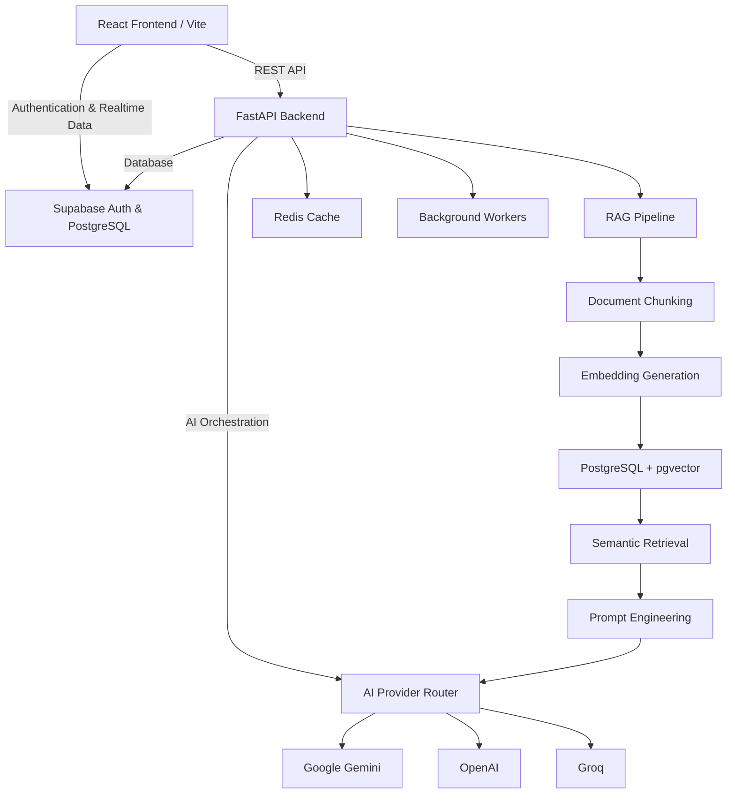

# 🌟 SHAKTHI — Empowering Women Athletes

**SHAKTHI** (*Safety-first Mentorship and Scholarship Platform for Female Athletes*) is a production-grade digital ecosystem designed to connect, guide, and protect aspiring women athletes across India. The platform combines a modern React web application with a powerful FastAPI backend powered by **LangChain**, **Retrieval-Augmented Generation (RAG)**, and **Large Language Models (LLMs)** to provide AI-powered mentorship, scholarship discovery, sports-friendly college recommendations, and secure anonymous safety reporting.

---

# 🏗️ System Architecture



---

# 🛠️ Complete Tech Stack

## 🎨 Frontend

- React 18
- Vite
- TypeScript
- React Router v7
- Tailwind CSS
- shadcn/ui
- Radix UI
- Lucide React
- TanStack Query (React Query v5)
- React Context API
- Axios
- React Hook Form
- Zod
- Supabase JavaScript SDK

---

## ⚙️ Backend

- Python 3.11+
- FastAPI
- Uvicorn
- SQLAlchemy 2.0
- AsyncPG
- Alembic
- Pydantic v2
- Celery
- Redis
- AsyncIO

---

## 🗄️ Database

- PostgreSQL
- Supabase
- pgvector
- Vector Search
- Semantic Search

---

## 🤖 Artificial Intelligence

### LLM Providers

- Google Gemini 2.5 Flash
- OpenAI GPT
- Groq LLMs

### AI Frameworks

- LangChain
- Retrieval-Augmented Generation (RAG)
- Prompt Engineering
- AI Provider Router
- AI Guardrails
- Context Injection
- AI Risk Analysis
- AI Moderation
- Dynamic Provider Routing

---

## 📚 RAG Pipeline

- PDF Processing
- Document Parsing
- RecursiveCharacterTextSplitter
- Document Chunking
- Metadata Extraction
- Embedding Generation
- Vector Embeddings
- pgvector Storage
- Semantic Search
- Similarity Search
- Context Retrieval
- Grounded Prompting
- Citation Generation
- Hallucination Reduction

---

## 🔍 AI Features

- Scholarship Recommendation
- College Recommendation
- Athlete Mentorship Assistant
- Legal & Safety Question Answering
- AI Chat Assistant
- Verified Source Citations
- Safety Message Risk Detection
- AI Provider Failover

---

## 🔐 Authentication & Security

- JWT Authentication
- Refresh Tokens
- Role-Based Access Control (RBAC)
- Protected Routes
- Password Hashing
- Environment Variables
- Secure REST APIs

---

## 📡 APIs

- REST APIs
- Async FastAPI Endpoints
- JSON APIs
- Dependency Injection
- Request Validation
- Response Models

---

## ⚡ Background Processing

- Redis
- Celery
- Background Workers
- Task Queue

---

## 🧪 Testing

- Pytest
- Unit Testing
- API Testing
- Schema Testing

---

## 🚀 DevOps

- Docker
- Docker Compose
- Git
- GitHub
- Virtual Environments
- Production Deployment

---

# 🧠 AI Architecture

```text
                        User
                          │
                          ▼
                React + Vite Frontend
                          │
            Authentication & API Requests
                          │
         ┌────────────────┴────────────────┐
         ▼                                 ▼
 Supabase Auth                    FastAPI Backend
   PostgreSQL                           │
                                        │
                         ┌──────────────┴──────────────┐
                         ▼                             ▼
                  AI Provider Router             Redis Cache
                         │
        ┌────────────────┼─────────────────┐
        ▼                ▼                 ▼
 Google Gemini        OpenAI             Groq
                         ▲
                         │
                  Prompt Engineering
                         ▲
                  Context Retrieval
                         ▲
                  Semantic Search
                         ▲
            PostgreSQL + pgvector
                         ▲
                 Vector Embeddings
                         ▲
              Document Chunking
                         ▲
              PDF / Knowledge Base
```

---

# 🌟 Core Features

- AI-powered Mentorship Assistant
- Scholarship Discovery
- Sports-Friendly College Recommendation
- Retrieval-Augmented Generation (RAG)
- Semantic Search
- AI Provider Routing
- Anonymous Safety Reporting
- Athlete Risk Detection
- AI Content Moderation
- Guardian Dashboard
- Mentor Dashboard
- Admin Dashboard
- Safety Officer Portal
- Coach Portal
- Sponsor Portal
- Role-Based Authentication
- JWT Security
- Realtime Database Synchronization
- Background Processing
- Dockerized Deployment

---

# ⚙️ Environment Variables

### Backend

```env
APP_NAME=SHAKTHI
ENVIRONMENT=development
DEBUG=true
PORT=8000

DATABASE_URL=postgresql://<user>:<password>@<host>:5432/<db>

REDIS_URL=redis://localhost:6379/0

JWT_SECRET_KEY=your-secret
JWT_REFRESH_SECRET_KEY=your-refresh-secret

GEMINI_API_KEY=your-gemini-api-key
OPENAI_API_KEY=your-openai-api-key
GROQ_API_KEY=your-groq-api-key

PRIMARY_AI_PROVIDER=gemini
GEMINI_MODEL=gemini-2.5-flash

ENABLE_RAG=true
ENABLE_SEMANTIC_SEARCH=true
PGVECTOR_ENABLED=true
```

### Frontend

```env
VITE_SUPABASE_URL=https://your-project.supabase.co
VITE_SUPABASE_ANON_KEY=your-anon-key
VITE_API_URL=http://localhost:8000/api/v1
```

---

# 🚀 Local Setup

```bash
# Clone Repository
git clone <repository-url>

# Backend
python -m venv venv

# Windows
venv\Scripts\activate

# Linux/macOS
source venv/bin/activate

pip install -r requirements.txt

alembic upgrade head

python -m app.seed_data

uvicorn app.main:app --reload
```

```bash
# Frontend
cd project

npm install

npm run dev
```

```bash
# Docker
docker-compose up -d

docker-compose exec backend alembic upgrade head

docker-compose exec backend python -m app.seed_data
```

---

# 🧪 Testing

```bash
pytest

pytest --cov=app

pytest tests/test_auth.py
```
